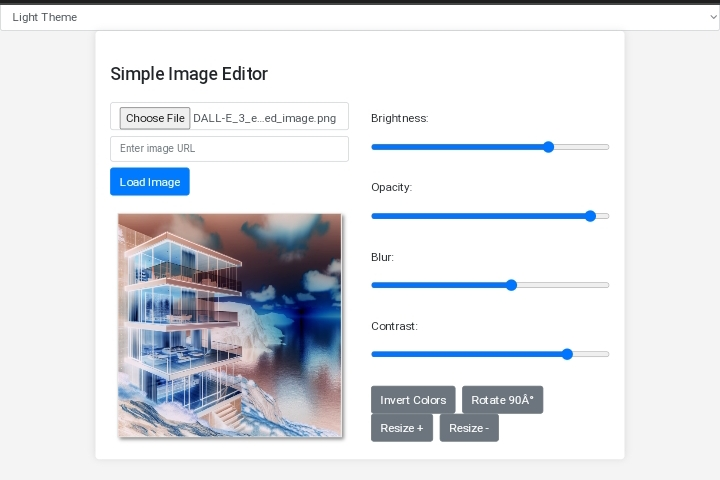

# Simple Image Editor

A simple web-based image editor that allows you to adjust the brightness, opacity, blur, contrast, and invert colors of an image. You can also rotate the image and resize it using arrow buttons. This project is hosted on GitHub Pages at [https://shadbalti.github.io/Simple-image-editor/](https://shadbalti.github.io/Simple-image-editor/).

## Features

- Upload and display images.
- Adjust brightness, opacity, blur, contrast, and invert colors.
- Rotate images in 90-degree increments.
- Resize images using arrow buttons.
- Load images from external URLs.

## Demo

For a live demonstration of this project, visit [https://shadbalti.github.io/Simple-image-editor/](https://shadbalti.github.io/Simple-image-editor/).

## How to Use

1. Open the web app.
2. Click the "Choose File" button to upload an image from your local device or enter the URL of an image.
3. Use the adjustment sliders to modify the image.
4. Click the arrow buttons to resize the image.
5. Click the "Rotate" button to rotate the image 90 degrees.
6. Experiment with the various settings to edit your image.

## Technologies Used

- HTML
- CSS
- JavaScript

## Contributing

Contributions to this project are welcome! If you'd like to contribute, please follow these steps:

1. Fork the repository.
2. Create a new branch for your feature: `git checkout -b feature-name`.
3. Make your changes and commit them: `git commit -m 'Add feature'`.
4. Push to the branch: `git push origin feature-name`.
5. Open a pull request.

## License

This project is licensed under the MIT License - see the [LICENSE](LICENSE) file for details.

## Contact

If you have any questions or feedback, feel free to [contact me](shadbalti2@gmail.com).

Enjoy editing your images with the Simple Image Editor!

[View Live Demo](https://shadbalti.github.io/Simple-image-editor/)
